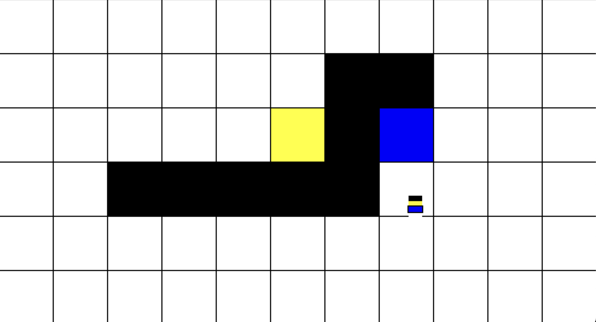
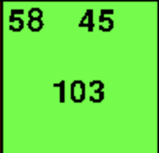
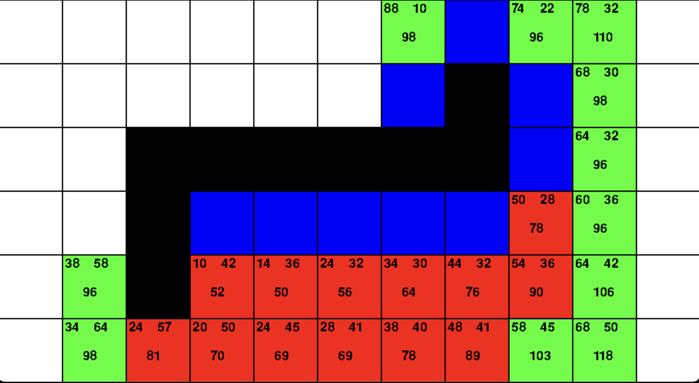

# AStar-Visualization

I am trying to implement *a path finding algorithm and create a visualization of it with Python and numpy library

## Requirement

- [pygame](https://www.pygame.org/wiki/GettingStarted)
- [numpy](https://numpy.org)

## Install requirements

### MacOS/Linux

```bash
pip3 install pygame
pip3 install numpy
```

### Windows

```bash
pip install pygame
pip install numpy
```

## Run

### MacOS/Linux

```bash
python3 main.py
```

### Windows

```bash
python main.py
```

## Controls

exit window - esc  

selecting of color - arrow up, arrow down

drawing state - 1  
calculating state - 2  
final result - 3  

## Drawing



- Black = barriers
- Yellow = start
- Blue = end

## Calculating



value (left) - distance from start  
value (right) - distance from end
value (center) - distance start + end

## Final result



Display the optimal route from the starting point to the ending.
